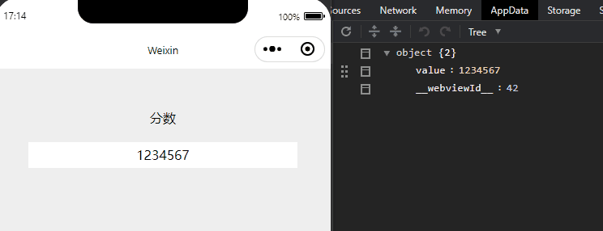
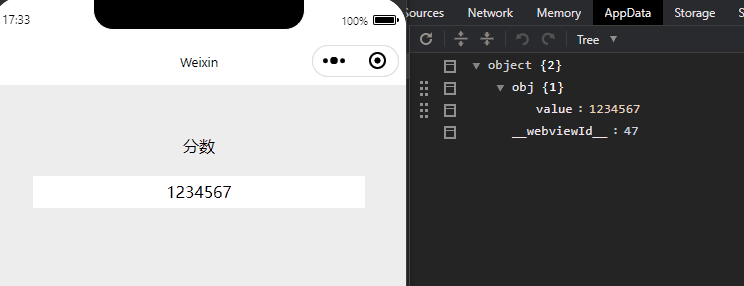

#### 小程序本身支持简单双向绑定

```html
<!-- wxml -->
<input model:value="{{ value }}" />
```

```js
// js
data: {
  value: "1234567"
}
```



#### 没有问题，可遇到复杂点的引用类型如何实现双向绑定呢

<!--more-->

- 放弃使用自带双向绑定`model:value="{{}}"`，直接使用`vulue="{{}}"`获取值，打通从`data`到`页面`的绑定
- 使用`bindinput`，把`obj.value`中的`value`作为`key`值传递
- 再在`bindinput`方法中分别获取到`key`和`value`，使用`拼接对象属性名`赋值给`data`，实现从`页面`到`data`的绑定


```html
<!-- wxml -->
<input 
  value="{{ obj.value }}"
  bindinput="bandInput"
  data-key="value"
/>
```

```js
// js
data: {
  obj: {
    value: "1234567"
  }
},

bandInput(e) {
  const dataset = e.currentTarget.dataset
  const key = dataset.key
  const value = e.detail.value
  // 拼接对象属性名
  const attributeName = `obj.${key}`
  this.setData({
    [attributeName]: value
  })
}
```



搞定